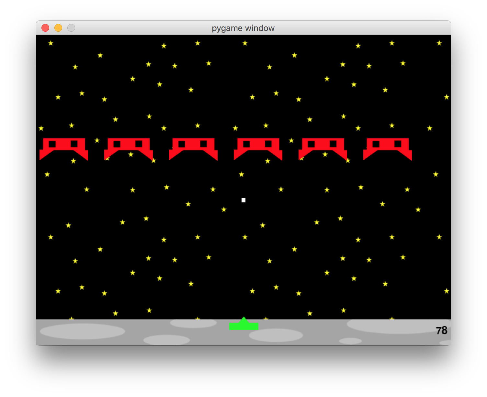

## Space Invaders

This was my first time programing anything with pictures. I followd the tutorial from Hello Bunny fairly closely, but there were still a lot of challenges to adapting it to space.

The left and right arrow keys move the launcher back and forth, and the up arrow key fires missiles at the invaders.

My next step is to add more aliens. For the six I have now, I actually told them to appear at pixel number n or m. Ideally, they'd figure out where they belong automatically. I first need to generalize the program to allow for more than six in a row, and then add more rows.

Alien number 4 is about to be blown from the sky!

### Files:

Main Program: "GoodbyeSpace.py"
Tutorial Program: "HelloBunny.py"

First Attempt: "SpaceInvaders.py"
  (before I realized getting input from the command line would be a problem)

PPT is for making the graphics
